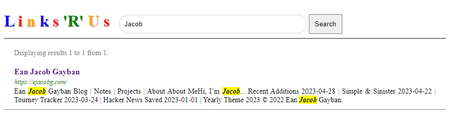

# Links 'R' Us

Example project made following instructions from Achilleas Anagnostopoulos's ["Hands-On Software Engineering with Golang"](https://www.packtpub.com/product/hands-on-software-engineering-with-golang/9781838554491). It is an adaptation of the original repository, updated to use newer packages and reorganized to suit my liking.

_Links 'R' Us_ is a web crawler and search engine that uses PageRank to order its results. It provides a frontend for submitting new links to index or search terms to look up. Note that the crawler only supports (non-code) text-based content (i.e. HTML and TXT). 

_Links 'R' Us_ provides both an in-memory and external data store/text indexer in the form of CockroachDB and Elasticsearch, respectively. It can be extended to use any data store or text indexer implementation, granted it satisfies the required interfaces. 

## Requirements

This project makes use of the following programs. It is **not required to install any of them** since the monolithic version can run entirely in-memory. The particular versions I used have been listed in (parentheses):

* [CockroachDB](https://www.cockroachlabs.com/docs/stable/install-cockroachdb.html) (22.2.9)
* [Elasticsearch](https://www.elastic.co/downloads/elasticsearch) (8.7.1)
* [`migrate`](https://github.com/golang-migrate/migrate)

The following are needed to run the distributed version of the project:

* [Docker Desktop](https://www.docker.com/) (4.19.0 (106363))
* [VirtualBox](https://www.virtualbox.org/) (7.0.8)
* [`kubectl`](https://kubernetes.io/docs/tasks/tools/#kubectl) (1.27)
* [`helm`](https://helm.sh/) (3.11.3)
* [Minikube](https://minikube.sigs.k8s.io/) (1.30.1)

Currently, the distributed version **does not** work. The Makefiles, instructions, and manifests for running the distributed version have been provided, however they may need to be edited in order to work properly with this layout. 

## Usage

There are two versions of the program: a monolithic version that compiles to a single binary and can be run on your machine, and a microservice-based version that is meant to be deployed on a Kubernetes cluster. As of now, the Makefile targets for deploying this cluster do not work.

### Monolith

```
Usage of monolith:
  -crawler-num-workers int
        The number of workers to use for crawling web-pages (defaults to number of CPUs) (default 8)
  -crawler-reindex-threshold duration
        The minimum amount of time before re-indexing an already-crawled link (default 168h0m0s)
  -crawler-update-interval duration
        The time between subsequent crawler runs (default 5m0s)
  -frontend-listen-addr string
        The address to listen for incoming front-end requests (default ":8080")
  -frontend-max-summary-length int
        The maximum length of the summary for each matched document in characters (default 256)
  -frontend-results-per-page int
        The number of entries for each search result page (default 10)
  -link-graph-uri string
        The URI for connecting to the link-graph (supported URIs: in-memory://, postgresql://user@host:26257/linkgraph?sslmode=disable) (default "in-memory://")
  -pagerank-num-workers int
        The number of workers to use for calculating PageRank scores (defaults to number of CPUs) (default 8)
  -pagerank-update-interval duration
        The time between subsequent PageRank score updates (default 1h0m0s)
  -partition-detection-mode string
        The partition detection mode to use. Supported values are 'dns=HEADLESS_SERVICE_NAME' (k8s) and 'single' (local dev mode) (default "single")
  -text-indexer-uri string
        The URI for connecting to the text indexer (supported URIs: in-memory://, es://node1:9200,...,nodeN:9200) (default "in-memory://")
```

Default values have been provided for all flags, so the monolithic version works right out of the box:

```shell
go run cmd/monolith
```

If you've installed CockroachDB, you can use the following make targets (in order) to get it set up:

```shell
make cdb/start
make cdb/setup
make cdb/migrations/up
```

If you've made changes to the CockroachDB DSN string, you should update the `.envrc` file with its correct value. When supplying a value for the `-link-graph-uri` flag, you should use `postgres://` for the URI scheme, **not** `cockroachdb://`.

If you've installed Elasticsearch, you can use the following target to get it set up:

```shell
make es/start
```

If you are _not_ on Windows, you should update the target to use `/bin/elasticsearch` instead of `/bin/elasticsearch.bat`.

Note that this target requires the use of an `ES_HOME` environment variable set to the location of your Elasticsearch installation.

### Microservices

Makefiles for deploying both your monolithic and microservice-based Kubernetes cluster can be found under the `k8s/` directory. Both directories provide their own README instructions, but in either case the steps are more or less the same.

For an example of what the output should look like, see these two videos: https://youtu.be/Oevqe9kKkKc https://youtu.be/w01k604kQ8o

Start the Minikube cluster using the following target:

```shell
make bootstrap-minikube
```

Add your cluster's Docker registry to the top-level object of your Docker daemon:

```json
{
  "insecure-registries": [
    "<minikube-ip>:5000"
  ]
}
```

Build and push all required Docker images to your registry:

```shell
make dockerize-and-push
```

Once your containers have been built, you can deploy the application:

```shell
make deploy
```

If successful, the frontend of the application will be available at `http://<minikube-ip>`.

There are two options for cleaning up the application:

```shell
kubectl delete namespace linksrus
```

This will delete the namespaces, but will **retain the CockroachDB and Elasticsearch databases**. This will be useful if you want to switch between the monolithic and distributed versions of the application.

```shell
make purge
```

This is a more complete version of `make deploy`. This deletes our namespaces *as well as* any CockroachDB and Elasticsearch data.

To fully clean everything up, run the following commands:

```shell
docker system prune
minikube delete
```

You may need to wait a bit before running `minikube delete` since `docker system prune` will write to some logs needed by it.

## Examples

If your application was launched, visiting `http://<minikube-ip>` or `http://localhost:<port>` (depending on how you deployed it) will result in the following homepage:


Submit a link to be crawled in the next pass:


If you're running the application for the first time, you may not have anything indexed yet:


Wait a bit for the crawler to index all of its links, then run your search query again:


